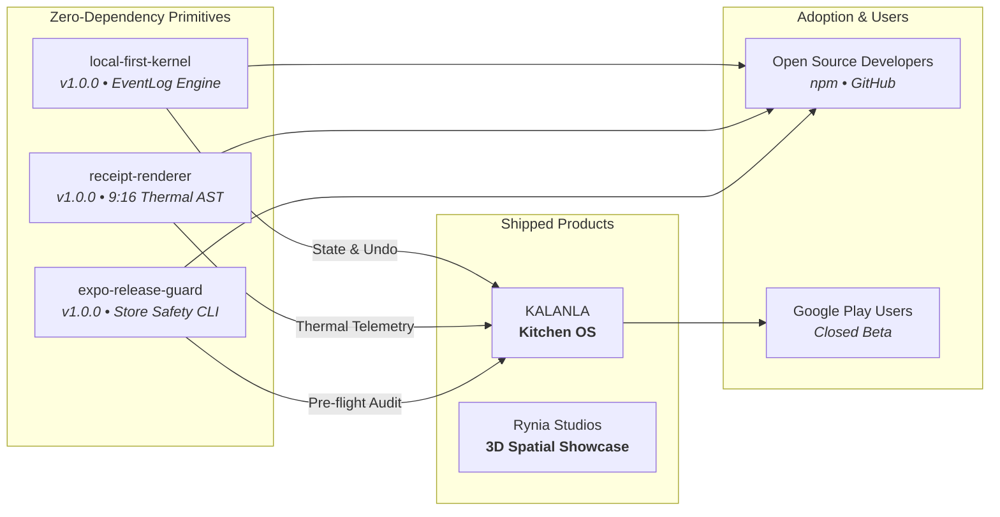

# ⚔️ Muharrem Özmen (@Rynia)
### *Independent Systems Craftsman & Software Architect*
**I build small, zero-dependency systems primitives from real products I ship.**

<p align="center">
  
</p>

<p align="center">
  <a href="https://github.com/Rynia/KALANLA/releases"></a>
  
  
  
</p>

---

## 🔭 Why Follow?

I design and maintain production-grade, zero-dependency TypeScript primitives extracted directly from real applications I build and ship:

* 🔒 **Zero Dependencies:** Audited, lightweight primitives with `0 npm runtime dependencies`.
* 🛡️ **No Abandoned Side-Projects:** Every open-source package is battle-tested in and actively maintained by production apps like **[KALANLA](https://github.com/Rynia/KALANLA)**.
* ⚡ **Local-First & Ambient:** Strict data sovereignty, deterministic predictability, and quiet ambient UX.

> *[👉 Follow @Rynia](https://github.com/Rynia) to catch the next systems primitive as it ships.*

---

## 🏛️ System Architecture



---

## 🚀 Open Source Foundations

| Primitive | Role & Core Innovation | Stack | Status | Repository |
|:---|:---|:---|:---|:---|
| **[local-first-kernel](https://github.com/Rynia/local-first-kernel)** | Append-only reactive event micro-kernel, schema migrations & deterministic undo/redo. | TypeScript, EventLog | 🟢 `v1.0.0` | [github.com/Rynia/local-first-kernel](https://github.com/Rynia/local-first-kernel) |
| **[expo-release-guard](https://github.com/Rynia/expo-release-guard)** | Pre-flight zero-rejection store safety CLI: Apple Privacy Manifests, permissions, EAS profiles. | Node.js, TypeScript, AST | 🟢 `v1.0.0` | [github.com/Rynia/expo-release-guard](https://github.com/Rynia/expo-release-guard) |
| **[receipt-renderer](https://github.com/Rynia/receipt-renderer)** | Zero-dependency 9:16 retro thermal receipt AST engine with dual SVG & terminal ASCII output. | TypeScript, Canvas, SVG | 🟢 `v1.0.0` | [github.com/Rynia/receipt-renderer](https://github.com/Rynia/receipt-renderer) |

---

## 📱 Shipped Products & Spatial Viewports

| Product | Domain & Vision | Stack | Status | Showcase |
|:---|:---|:---|:---|:---|
| **[KALANLA](https://github.com/Rynia/KALANLA)** | Smart Kitchen OS eliminating food waste through deterministic shelf-life telemetry and recipes. | React Native, Expo, SQLite | 🟢 Closed Beta | [rynia.github.io/KALANLA](https://rynia.github.io/KALANLA/) |
| **[Rynia Studios](https://github.com/Rynia/RyniaStudioSite)** | Immersive 3D WebGL laboratory for ambient software and interactive viewport shaders. | Three.js, GSAP, Lenis, Vite | 🟢 Live | [ryniastudios.netlify.app](https://ryniastudios.netlify.app) |

---

## 🛠️ Stack & Craftsmanship

<p align="left">
  
  
  
  
  
  
</p>

---

## 📊 Live Activity & Telemetry

<p align="center">
  
</p>

```text
2026 ROADMAP & MILESTONES:
├─ KALANLA            ─── [In Closed Testing] Google Play 14-day Verification Wave
├─ expo-release-guard ─── [Target] awesome-react-native Development Tools PR
├─ receipt-renderer   ─── [Target] Show HN + Live Web Playground Showcase
└─ local-first-kernel ─── [Target] P2P Local Wi-Fi CRDT Sync Extension
```

---

<p align="center">
  <b>Rynia Studios</b> • <i>"The best software is software you own. On your device. Without permission."</i><br/>
  📫 Inquiries: <b>ryniastudios@gmail.com</b> • 🌐 <b><a href="https://ryniastudios.netlify.app">ryniastudios.netlify.app</a></b>
</p>
